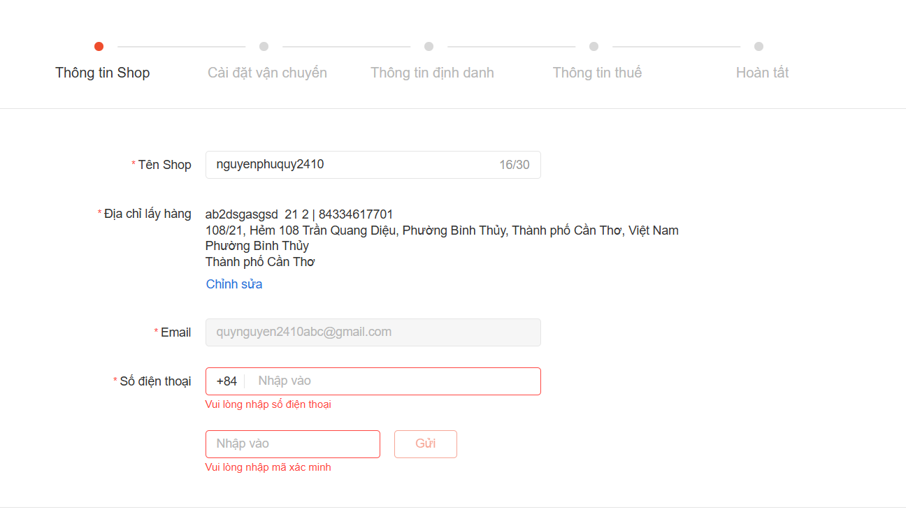
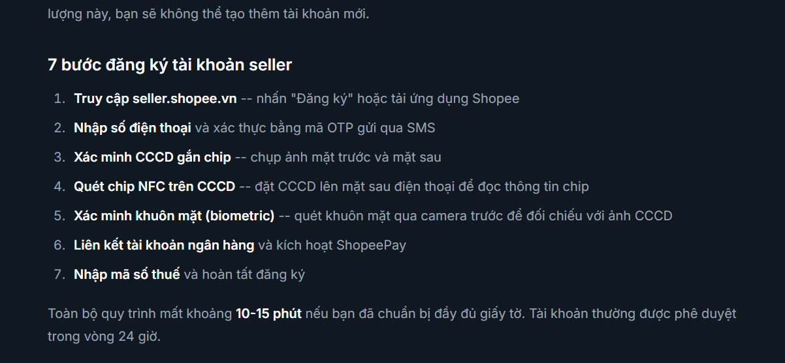

voucher: discount ship, discount price(có điều kiện)
follow shop: nhận thông báo,
shop collection: danh mục của sốp

quy trình đăng ký từ Customer -> Seller:
thông tin cần thiết:
- tên shop
- địa chỉ lấy hàng(địa chỉ shop): bao gồm họ tên, số điện thoại, tỉnh/thành phố và xã/phường (cân nhắc việc sử dụng database đồng bộ trên repo sau: https://github.com/thanglequoc/vietnamese-provinces-database.git), địa chỉ chi tiết (hiện tại sẽ chỉ triển khai chi tiết địa chỉ là Text). (Note: 1 shop có nhiều địa chỉ)
- email (mặc định là email của customer)
- số điện thoại và xác minh số điện thoại chính cho shop

thông tin chủ shop:
- cccd
- mã số thuế

SAU KHI ĐĂNG KÝ THÀNH CÔNG:
Giai đoạn setup shop:
- setup avt
- ảnh bìa
- mô tả shop

Giai đoạn lên hàng:
- đăng sản phẩm lên shop. Sản phẩm gồm các ảnh và video.
- tiêu đề sản phẩm 

Ảnh tham khảo

tham khảo trên shopee

link tham khảo:
[link](https://sellygenie.com/vi/blog/huong-dan-ban-hang-shopee)